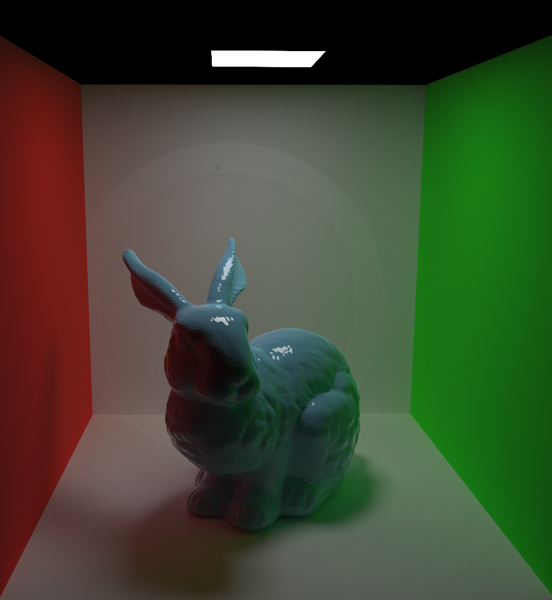
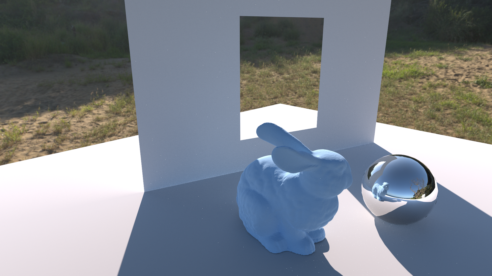
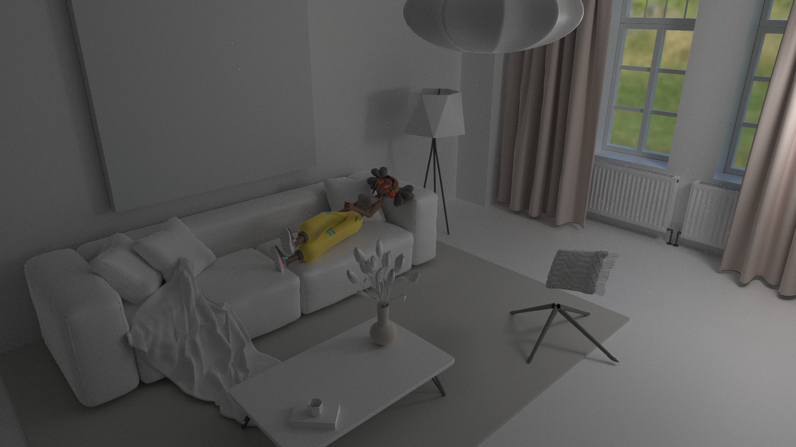
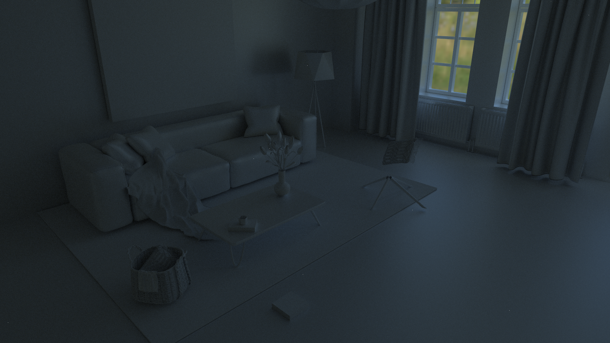
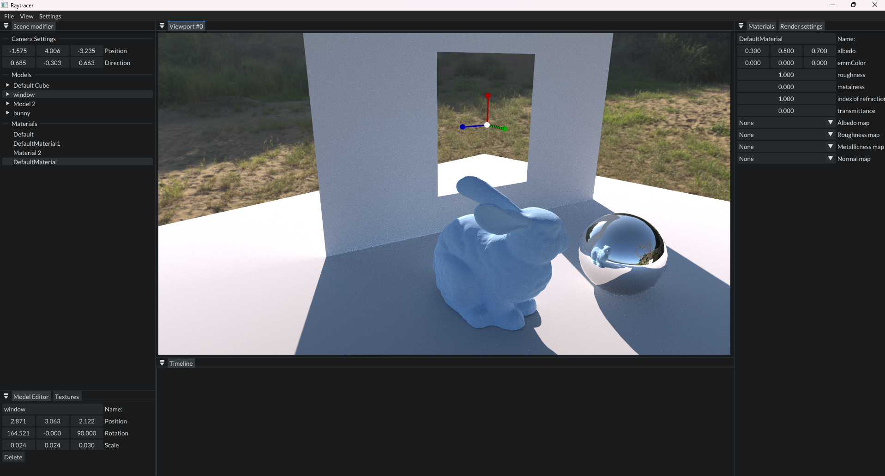

# Emerald Engine

Emerald engine is a path tracing software that I made to learn about physically based rendering with monte carlo integration. It uses the ray tracing pipeline in vulkan to calculate a path for each pixel. It supports the fairly basic stuff like disney bsdf materials, really basic animation, skinning etc.

It follows the concepts mainly from pbrt.org.

I'll have to admit that it has certain bugs, also I don't have the luxury of testing it on multiple machines, so I can only guarantee that it runs on my laptop :P

Its mostly made for me to learn these concepts and to make a simple UI acompanining it.

Here are some renders and screenshots 
(*and dont forget to pay close attention to my amazing animation skills!*):

