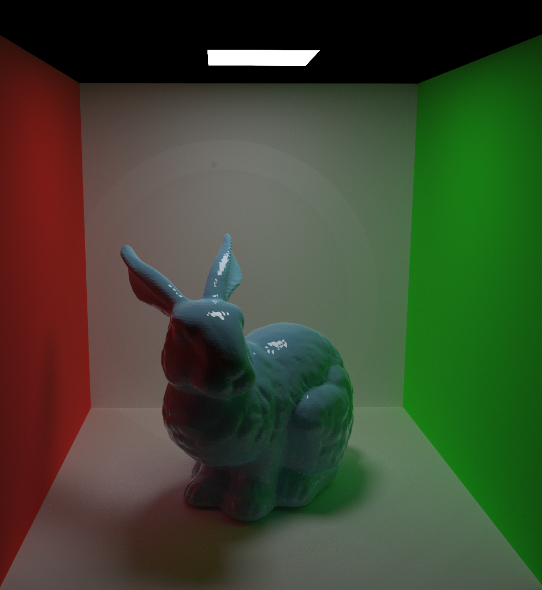
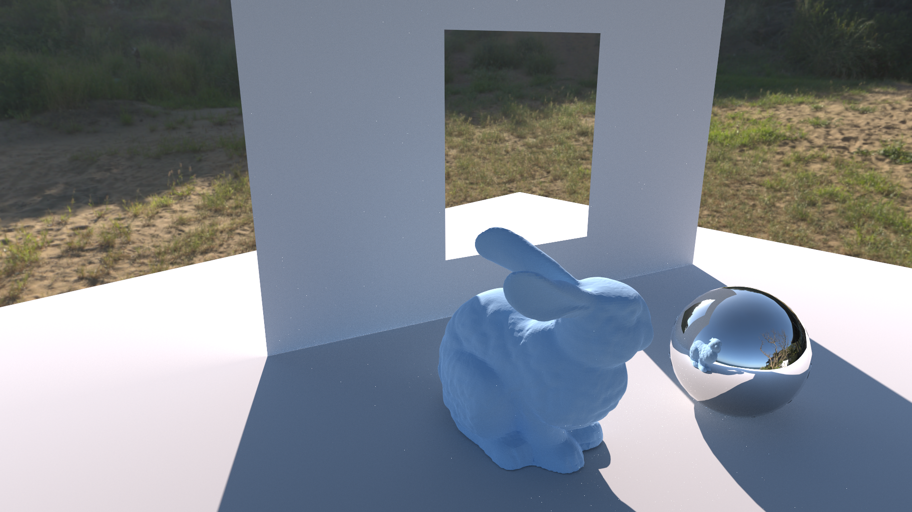
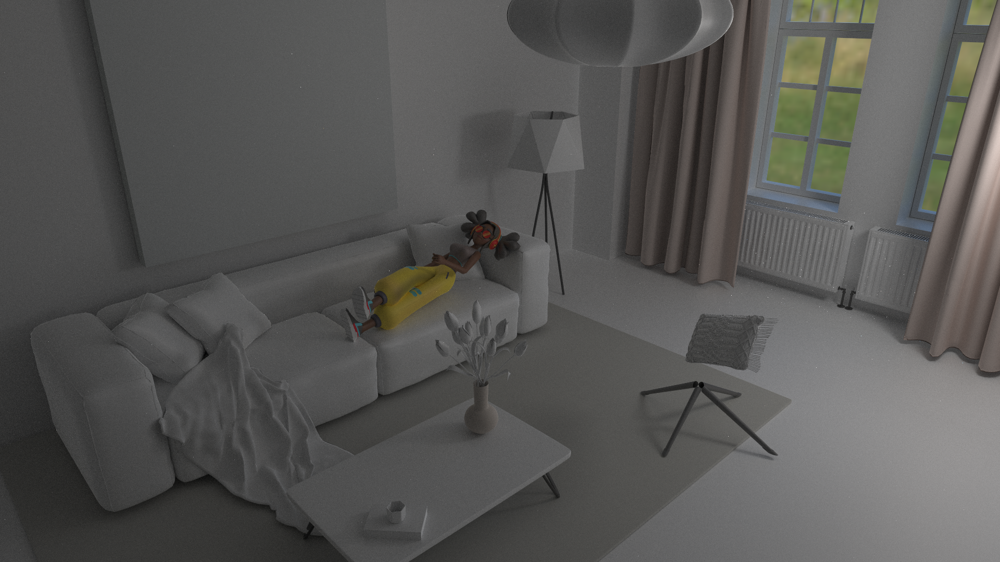
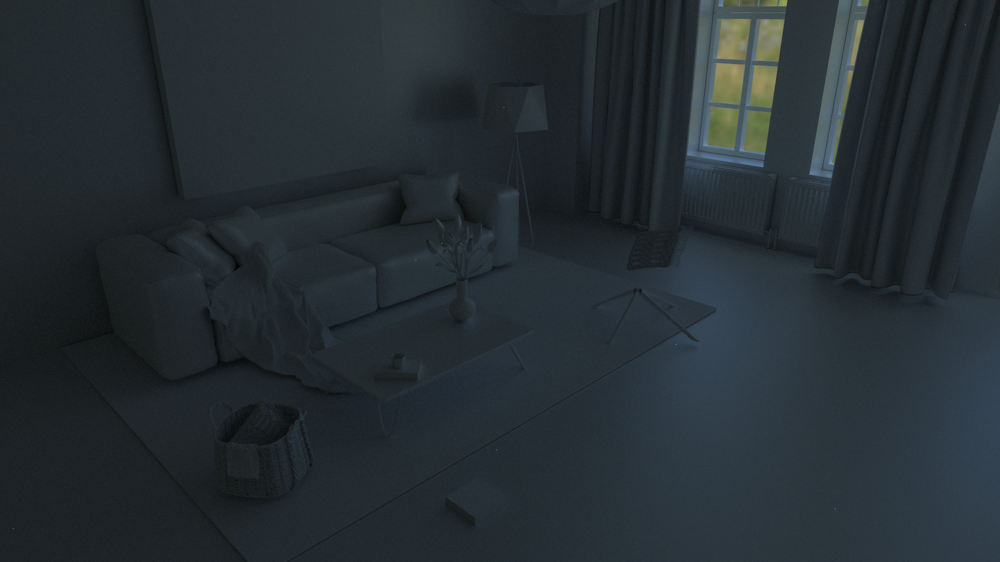

# Emerald Engine

A Vulkan-based path tracer built to learn physically based rendering and Monte Carlo
integration, following the concepts in *Physically Based Rendering* (pbrt.org).

*(top renders/screenshots here — and don't forget to admire my amazing animation skills)*

## What it does

Emerald Engine uses Vulkan's hardware ray tracing pipeline to compute a light-transport
path per pixel.

**Features**
- Vulkan ray tracing pipeline (per-pixel path tracing)
- Disney principled BSDF materials

## Why I built it

This was a learning project to actually understand PBR and Monte Carlo light transport
from the inside, rather than just reading about them — implementing the Disney BSDF and
getting importance sampling to behave taught me more than any tutorial did.

## Known limitations

- Only tested on my own laptop (Windows 11, AMD Ryzen 7, Radeon 780M Graphics) — I can't
  currently guarantee it builds or runs elsewhere.

This is a rewrite from the old branch. Removed some features, because I'm switching the focus on trying to test out different algorithms and mathematical models.
